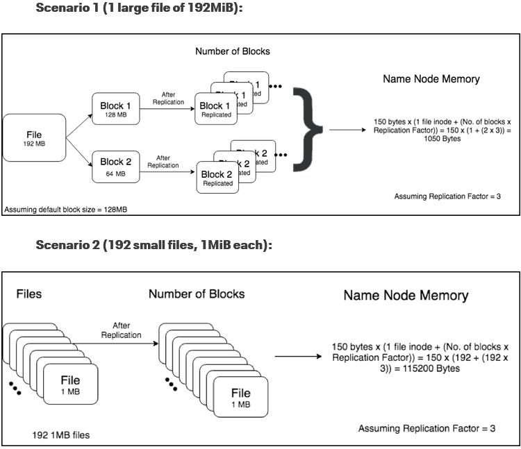

# Background
Hadoop can handle with very big file size, but will encounter performance issue with too many files with small size. The reason is explained in detailed from [here](https://blog.cloudera.com/small-files-big-foils-addressing-the-associated-metadata-and-application-challenges/). In short, every single on a data node needs 150 bytes RAM on name node. The more files count, the more memory required. 

Below picture shows a clear affects of storing too many files on HDFS with default block size of 128 MB and replication factor of 3. In scenario 1, we have 1 file 192MB which is splitted to store in two blocks. Those blocks will be then replicated into 3 different blocks. So total, it only needs `2*3 = 6` blocks.

On the contrary, scenario 2 dealing with the same file but splitted into 192 files, 1MB each. This resulted into `192*3 = 576` blocks. And with the name node memory calculation, scenario 2 takes more than 100x memory needed on name node compared to scenario 1.

<p align="center">
    
</p>

In practice, we've exprienced the slowness on querying data from Hive, Impala and Spark application on table stored up to several million files within a single partition. In addition to that, services deployed on name node encounter low performance (Zeppelin, etc.).

# How many files gerenated & How to prevent?
* Streaming job is one of sources generating so many files. It depends on how window time is set, the longer windows time, the less number of files written to HDFS and the trade-off is latency reduced.

* Batch job with large number of mappers/reducers on MapReduce, or highly partitions when storing data to disk on Spark (Default is 200 partitions). For this case, it can be prevented by proactively configurate number of data files writing down to HDFS.

    * MapReduce: configure hive setting as below example:
        ```xml
        set hive.exec.compress.output=true;
        set hive.exec.parallel = true;
        set parquet.compression=snappy;
        set hive.merge.mapfiles=true;
        set hive.merge.mapredfiles=true;
        set hive.merge.smallfiles.avgsize = 134217728;        --128M
        set hive.merge.size.per.task = 268435456;             --256M
        set hive.optimize.sort.dynamic.partition = true;
        set parquet.blocksize= 268435456;                     --256M
        set dfs.block.size=268435456;                         --256M
        ```

    * Spark: apply `coalesce` or `repartition` at step of insert data into a table. How to use these function effectively, please find more on `References` section.

For existing tables with many small files, to fix this issue will need a tool. I did write a pyspark tool  called `spark-kompactor` to overcome this problem in our circumstances of many tables under line with so many small files generated by Hive or Spark batch jobs.

# What is spark-kompactor
This is a tool written in pyspark to compact small files underline for Hive tables on HDFS. This help to reduce the workload burdon on Name Node of a Hadoop cluster.

# How it works
The tool works for only table having partitions and run on scheduled for maintaining purpose. This will help to prevent conflict writting on latest partition as most of our jobs are running in incremental manner. Below steps showing its compacting operation:
    
1. Scan partitions on provided table
1. Count number of files and total size for each partition
1. Checkout data of each partition, repartition it (compacting) based on default block size.
1. Overwrite partition with repartitioned data 

    To prevent the conflict writing, within spark configuration, the `spark.hadoop.hive.exec.stagingdir` is configured to write to other directory instead of default one.

# How to run it
As this is a Spark application, simply run below spark-submit command with your input table name. Bear in mind that, your account should be accessible and have DML privilege to that table.

```bash
spark-submit --master yarn --deploy-mode client --driver-memory 2g --executor-memory 2g --executor-cores 2 --files logging.ini kompactor.py --table_name bdp_ap_it.music_service_raw
```

## References
* [On Spark, Hive, and Small Files: An In-Depth Look at Spark Partitioning Strategies](https://medium.com/airbnb-engineering/on-spark-hive-and-small-files-an-in-depth-look-at-spark-partitioning-strategies-a9a364f908)
* [Building Partitions For Processing Data Files in Apache Spark](https://medium.com/swlh/building-partitions-for-processing-data-files-in-apache-spark-2ca40209c9b7)
* [Compaction / Merge of parquet files](https://kontext.tech/column/spark/296/data-partitioning-in-spark-pyspark-in-depth-walkthrough)
* [Why does the repartition() method increase file size on disk?](https://stackoverflow.com/questions/54218006/why-does-the-repartition-method-increase-file-size-on-disk)